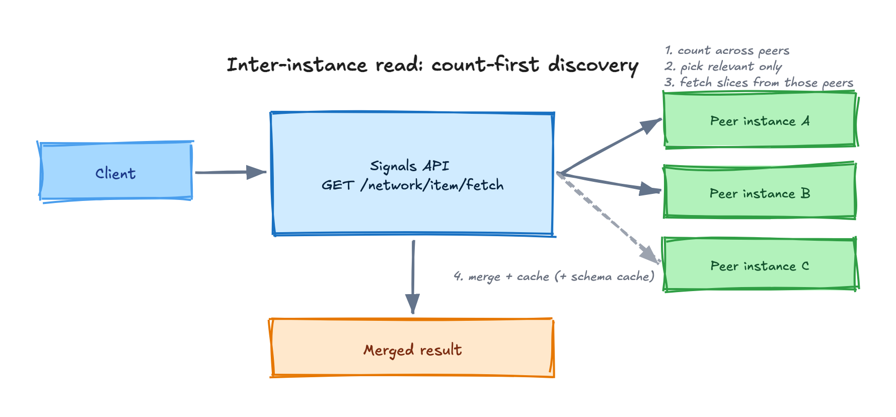

Signals keeps **two read layers strictly separate**. Before writing a read endpoint, decide which layer it belongs to.

## Instance-local read

```http
GET /api/v1/item/fetch
```

Reads an instance's **own** items, backed by a brief Redis cache. Use this for "my own items" reads. It does **not** reach across the network.

## Inter-instance read

```http
GET /api/v1/network/item/fetch
```

Reads **across instances** using a *count-first discovery* strategy:

1. **Count first** — ask peer instances how many relevant items they hold.
2. **Select peers** — pick only the peers that actually have relevant items.
3. **Fetch slices** — request just the needed slices from those peers.
4. **Merge & cache** — combine results and cache the merged view. **Schema fetching and caching live in this layer**, not in the instance-local layer.

This avoids the naive "every instance queries every other" fan-out and is the core scaling decision of the network.

<!-- Editable source: src/assets/diagrams/read-write-network-fetch.excalidraw — open at https://excalidraw.com to adjust, re-export PNG here. -->



## Write paths

Writes into Signals are deliberately constrained:

- The **Signals UI / direct clients** create items through the authenticated session path.
- **Integrating DPGs** (Aggregator app, voice DPG) write through **controlled bulk-create paths** using the [two-header service-auth model](/bluedots-docs/core-concepts/architecture/identity-and-auth/). In the MVP the Aggregator has no other write access to Signals.
- On write, the backend generates `item_instance_url` and `item_schema_url`; clients cannot set them.

## Reliability rules for writes and external calls

Every external call (including cross-instance fetches and writes) must have an **explicit timeout, at least one retry with exponential backoff, and a typed error**. Routes never throw — they return `reply.code(N).send({ error, message })`, handling Postgres `23505` (unique violation) and `23503` (FK violation) explicitly.
